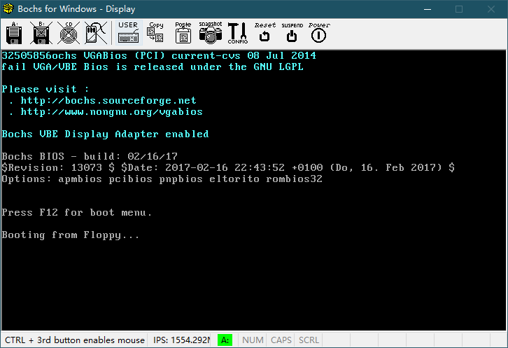
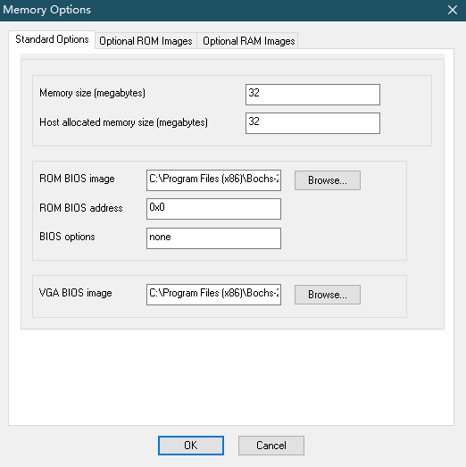

# X86_ASM

## 12.1

程序将在界面的左上角(即1行1列开始)实时显示已检测的字节数，如果检测失败，那么将在第二行显示fail字样:



注意，这里并不是因为真的失败而显示fail，原因是：代码中的检测次数写死为:

```assembly
;每次检测4B，所以总共需要检测(4GB - 1MB) / 4 次
mov eax, 1073479680
```

但是在我的机器上Bochs的默认内存大小是:



即32MB，所以实际最大可检测的大小为:
(32 - 1) * 1024 * 1024 = 32505856，

此数字与上面实验结果完全吻合，说明实验正确。😀