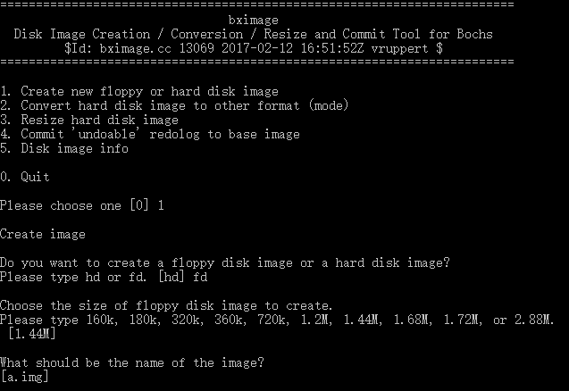
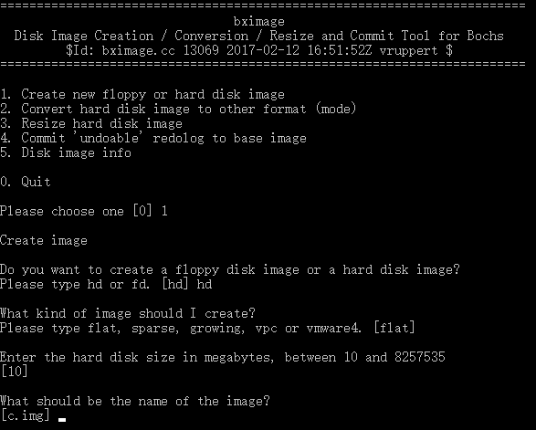
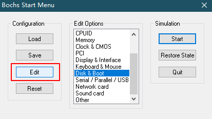
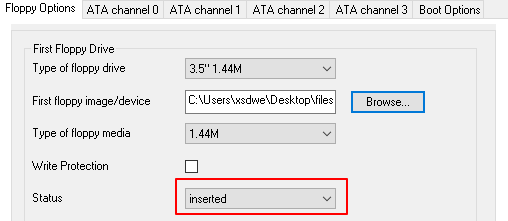
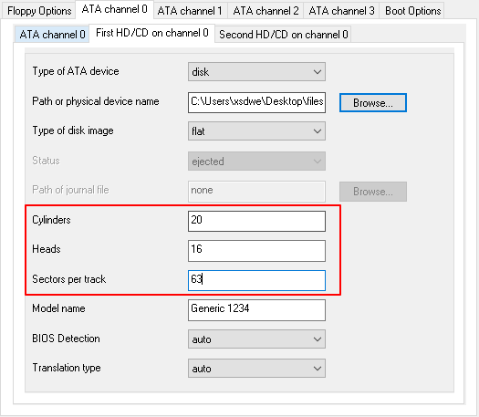
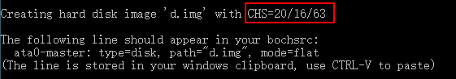

# 实验方法

从第8章开始，使用书中所说的VirtualBox已经无法完成正常的实验(反应为无法启动)，所以改为Bochs的方式，这里参考了: [硬盘和显卡的访问与控制](https://www.kancloud.cn/digest/protectedmode/121456)一文。

## 启动软盘

以第8章为例，我们将启动(mbr)程序写入到一个软盘中，创建软盘可以使用Bochs自带的bximage工具，方法很简单，如下图:



然后使用Linux命令(这里用的是Windows 10 Linux子系统):

```shell
dd if=c08_mbr.bin of=boot.img
```

boot.img便是我们新创建的1.44MB软盘。

## 硬盘

我们的主程序写入到一个硬盘中，同样使用bximage工具来完成创建，如下图:



然后同样使用dd命令将编译得到的c08.bin写入到硬盘中:

```shell
dd if=c08.bin of=c.img bs=512 seek=100 conv=notrunc
```

## Bochs配置

首先在主界面选择Disk & Boot进行配置，如下:



### 软盘



### 硬盘



解释一下红色方框处的三个参数的意义：

1. Cylinders: 柱面
2. Heads: 磁头
3. Sectors per track(SPT): 扇区数

当我们完成硬盘创建时，bximage工具会告诉我们这些参数，如下图:



Have fun! 😄